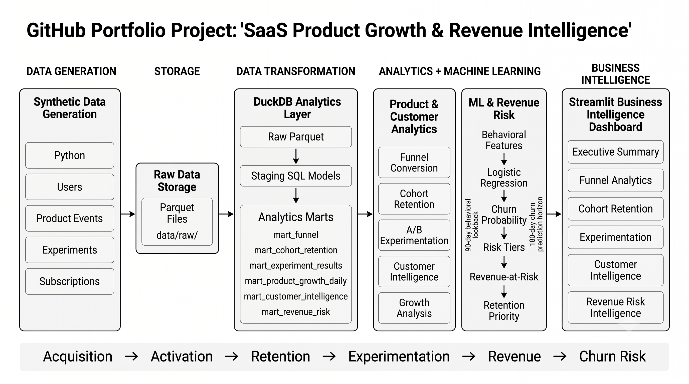

# SaaS Product Growth & Revenue Intelligence

**End-to-end product analytics, customer intelligence, experimentation, churn prediction, and revenue-risk platform for a B2B SaaS business.**

An analytics platform built with Python, SQL, DuckDB, Parquet, scikit-learn, and Streamlit to analyze the SaaS customer lifecycle from acquisition through activation, retention, revenue, and churn risk.

The project processes **1.45M+ product events and 100K customers** and combines descriptive analytics, experimentation, customer segmentation, predictive modeling, and revenue-risk prioritization into a single decision-support platform.

---

## Business Problem

A B2B SaaS company has a large user base but needs to understand where growth is being lost and which customers require attention.

The platform answers:

1. Where are users dropping out of the product funnel?
2. Which acquisition channels perform best?
3. How does customer retention change across cohorts?
4. Did the onboarding experiment improve activation?
5. Which customers are highly engaged but have not converted?
6. Which paying customers are most likely to churn?
7. How much current MRR is exposed to modeled churn risk?
8. Which accounts should a retention team prioritize?

---

## Key Findings

| Area | Finding |
| --- | --- |
| Customer base | 100,000 customers modeled |
| Product activity | 1,453,089 product events |
| Signup → Paid | 15.67% overall conversion |
| Largest funnel loss | 52.88% drop-off from project creation to paid |
| Experimentation | Treatment activation: 70.31% vs 67.27% control |
| Experiment lift | +3.04 percentage points, statistically significant |
| Churn model | 0.8902 ROC-AUC |
| Churn model | 0.1747 PR-AUC |
| Top-risk 10% | Captures 44.64% of future churners |
| Future churn baseline | 3.40% |
| Top-decile churn rate | 15.15% |
| Current MRR | $1.06M |
| Modeled revenue exposure | $250.8K |

> **Important:** Revenue exposure represents modeled expected exposure based on current MRR and predicted churn probability. It is not a forecast of guaranteed revenue loss.

---

## Architecture



The complete pipeline follows:

**Data Generation → Parquet Storage → DuckDB Transformation → Analytics & ML → Streamlit Dashboard**

See [`docs/architecture.md`](docs/architecture.md) for the detailed architecture and data flow.

---

# Analytics Modules

## 1. Funnel Analytics

The funnel tracks the SaaS journey:

**Signup → Workspace → Invite → Project → Paid**

Current overall results:

| Stage | Users | Conversion |
| --- | ---: | ---: |
| Signup | 100,000 | 100.00% |
| Workspace | 72,426 | 72.43% |
| Invite | 48,353 | 66.76% |
| Project | 33,264 | 68.79% |
| Paid | 15,674 | 47.12% |

Overall signup-to-paid conversion is **15.67%**.

The largest stage-level drop-off occurs between **project creation and paid conversion**, where 52.88% of users do not progress to paid.

---

## 2. Cohort Retention

Weekly signup cohorts are analyzed to understand how engagement changes over time.

The platform provides:

- Weekly cohort retention
- W1, W2 and W4 retention
- Retention heatmaps
- Average retention curves
- Cohort comparison
- Mature-cohort performance analysis

The analysis focuses on weekly retention because the underlying dataset is modeled at weekly cohort granularity.

---

## 3. Experimentation

The platform evaluates the `onboarding_v2` experiment.

### Results

| Metric | Control | Treatment |
| --- | ---: | ---: |
| Users | 10,095 | 9,905 |
| Activation rate | 67.27% | 70.31% |

**Absolute lift:** +3.04 percentage points

**Relative lift:** +4.52%

**z-statistic:** 4.6339

**p-value:** 0.000004

The result is statistically significant under the implemented hypothesis test.

The dashboard also provides confidence intervals and explains the statistical methodology.

> The experiment data is synthetic. Statistical significance in this dataset should not be interpreted as evidence from a real production experiment.

---

## 4. Customer Intelligence

The customer intelligence layer combines behavioral engagement with customer and subscription attributes.

Customers are segmented into:

- High Value
- Engaged
- At Risk
- Growth Opportunity
- Nurture
- Low Engagement
- Churned

The analysis combines:

- Product activity
- Active days
- Event diversity
- MRR
- Plan type
- Industry
- Acquisition channel

This allows the business to distinguish between:

**High-value customers → retention**

**Engaged non-paying customers → growth opportunities**

**Low-engagement customers → nurture campaigns**

---

## 5. Churn Prediction

A temporal churn-risk model predicts whether currently active paying customers will churn during a future 180-day horizon.

### Prediction setup

**Prediction cutoff:** 2025-07-01

**Behavior window:** 2025-04-02 → 2025-07-01

**Prediction horizon:** 2025-07-01 → 2025-12-28

**Eligible customers:** 13,167 active paying customers

**Future churners:** 448

**Future churn rate:** 3.40%

### Features

The model uses behavioral information available before the prediction cutoff:

- `days_since_last_event`
- `total_events`
- `distinct_event_types`
- `active_days`
- `customer_tenure_days`

MRR is deliberately excluded from the ML feature set to avoid using revenue information as a predictive input.

### Model

**Logistic Regression**

The model uses:

- StandardScaler
- Stratified train/test split
- Class weighting
- Fixed random seed

### Performance

| Metric | Result |
| --- | ---: |
| ROC-AUC | 0.8902 |
| PR-AUC | 0.1747 |
| Precision | 11.45% |
| Recall | 91.07% |
| F1 | 0.2034 |

The model is intentionally evaluated with emphasis on recall because the business use case is identifying customers for potential retention intervention.

---

## 6. Risk Prioritization

Rather than treating every predicted churner equally, customers are divided into:

- Low Risk
- Medium Risk
- High Risk

The highest-risk 10% of customers:

- Contains 330 customers
- Captures 50 of 112 test-set churners
- Captures **44.64% of observed future churners**
- Has a **15.15% churn rate**, compared with the 3.40% population baseline

This converts the ML model from a prediction exercise into a potential retention prioritization workflow.

---

## 7. Revenue Risk Intelligence

Revenue exposure is estimated as:

`Current MRR × Predicted Churn Probability`

Current modeled exposure:

**$250,758.97**

| Risk Tier | Customers | Current MRR | Modeled Exposure |
| --- | ---: | ---: | ---: |
| Low | 9,217 | $761,048 | $37,580 |
| Medium | 2,633 | $201,263 | $131,716 |
| High | 1,317 | $93,340 | $81,463 |
| **Total** | **13,167** | **$1,055,651** | **$250,759** |

The dashboard combines churn probability and revenue exposure to create a retention priority queue.

---

# Dashboard

The Streamlit application contains six business-focused pages:

| Page | Purpose |
| --- | --- |
| Executive Summary | Overall business health and key growth signals |
| Funnel Analytics | Conversion funnel and acquisition-channel analysis |
| Cohort Retention | Weekly retention and cohort comparison |
| Experimentation | A/B test results and statistical analysis |
| Customer Intelligence | Customer segmentation and growth opportunities |
| Revenue Risk Intelligence | Churn prediction, revenue exposure and retention prioritization |

---

# Technology Stack

| Layer | Technology |
| --- | --- |
| Programming | Python 3.13 |
| Data generation | NumPy, Faker |
| Data processing | pandas |
| Storage | Parquet |
| Analytics engine | DuckDB |
| SQL modeling | SQL |
| Machine learning | scikit-learn |
| Visualization | Plotly |
| Dashboard | Streamlit |
| Testing | Pytest |
| Environment | pyenv + pyenv-virtualenv |
| Pipeline | Make |

---

# Project Structure

```text
SaaS Product Growth & Revenue Intelligence/

├── Makefile
├── pyproject.toml
├── .python-version
│
├── data/
│   ├── raw/
│   ├── processed/
│   └── sample/
│
├── docs/
│   ├── architecture.md
│   └── architecture.png
│
├── sql/
│   ├── staging/
│   └── marts/
│
├── python/
│   └── src/
│       ├── generate_data.py
│       ├── run_sql_models.py
│       ├── analysis.py
│       └── metrics.py
│
├── streamlit_app/
│   ├── app.py
│   ├── pages/
│   │   ├── 01_executive_summary.py
│   │   ├── 02_funnel.py
│   │   ├── 03_cohorts.py
│   │   ├── 04_experimentation.py
│   │   ├── 05_revenue_risk.py
│   │   └── 06_customer_intelligence.py
│   └── utils/
│       └── data_loader.py
│
└── tests/
    ├── test_analysis.py
    ├── test_data_quality.py
    ├── test_generate_data.py
    ├── test_metrics.py
    └── test_sql_pipeline.py
